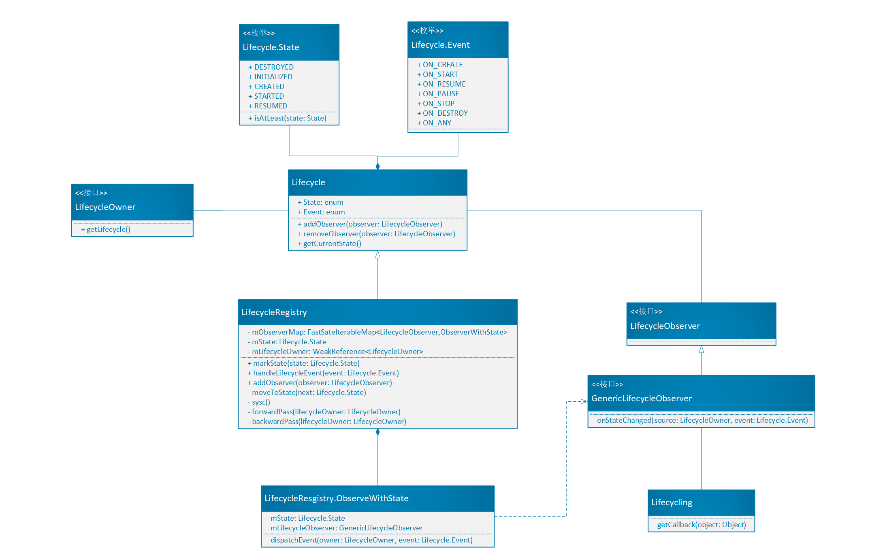

# 1. 现有生命周期管理存在的问题
Android系统中定义的大多数组件都是有生命周期的，并由系统管理。我们在开发时必须遵守这些生命周期的规则，需要根据生命周期的不同阶段，有针对性地管理组件状态，否则就会出现内存泄漏或者应用崩溃等问题。

假设现在有一个Activity需要在屏幕上显示设备当前的位置，通常的做法如下所示：
````java
class MyLocationListener {
    public MyLocationListener(Context context, Callback callback) {
        // ...
    }

    void start() {
        // connect to system location service
    }

    void stop() {
        // disconnect from system location service
    }
}


class MyActivity extends AppCompatActivity {
    private MyLocationListener myLocationListener;

    @Override
    public void onCreate(...) {
        myLocationListener = new MyLocationListener(this, (location) -> {
            // update UI
        });
    }

    @Override
    public void onStart() {
        super.onStart();
        myLocationListener.start();
        // manage other components that need to respond to the activity lifecycle
    }

    @Override
    public void onStop() {
        super.onStop();
        myLocationListener.stop();
        // manage other components that need to respond to the activity lifecycle
    }
}
````
这段代码虽然很简单，只在Activity的`onCreate()`方法中创建了位置监听器，并在`onStart()`方法中开始监听，在`onStop()`方法中停止监听。但是，在实际的App中一个Activity管理的UI会比较复杂，所以就需要在它的每个生命周期回调函数（例如在`onStart()`方法或`onStop()`方法）中编写大量的代码，这样会使得这些方法非常臃肿，不易维护。

此外，这样还无法保证组件在Activity或Fragment停止之前成功启动，例如：
````java
class MyActivity extends AppCompatActivity {
    private MyLocationListener myLocationListener;

    public void onCreate(...) {
        myLocationListener = new MyLocationListener(this, location -> {
            // update UI
        });
    }

    @Override
    public void onStart() {
        super.onStart();
        Util.checkUserStatus(result -> {
            // what if this callback is invoked AFTER activity is stopped?
            if (result) {
                myLocationListener.start();
            }
        });
    }

    @Override
    public void onStop() {
        super.onStop();
        myLocationListener.stop();
    }
}
````
这段代码和前面的不同之处是`onCreate()`方法中需要先检测系统是否允许该程序定位，假设这是一个耗时操作。因此如果程序执行到`super.onStart()`这里还没等`checkUserStatus()`执行完就执行了`onStop()`，那么myLocationListener的`stop()`方法就先于`start()`方法得到了执行，这使得当它的`start()`方法得到执行之后不会再调用`stop()`方法，所以Activity将会一直在后台监听位置的变化。

因此Google推出了独立的`android.arch.lifecycle`包来解决这些问题，这个包中提供的类和接口可以帮助我们以一种非常优雅的方式构建能感知生命周期的类，**所谓“感知生命周期”是指能够根据Activity或者Fragment的生命周期自行调整类的行为。**

# 2. LifeCycle
Lifecycle是一个包含组件生命周期状态的抽象类，而且允许其他类观察这些状态。

````java
public abstract class Lifecycle {

    @MainThread
    public abstract void addObserver(@NonNull LifecycleObserver observer);

    @MainThread
    public abstract void removeObserver(@NonNull LifecycleObserver observer);

    @MainThread
    @NonNull
    public abstract State getCurrentState();

    //生命周期事件
    @SuppressWarnings("WeakerAccess")
    public enum Event {
        ON_CREATE, ON_START, ON_RESUME, ON_PAUSE, ON_STOP, ON_DESTROY, ON_ANY
    }

    //生命周期状态
    @SuppressWarnings("WeakerAccess")
    public enum State {
        DESTROYED, INITIALIZED, CREATED, STARTED, RESUMED;

        public boolean isAtLeast(@NonNull State state) {
            return compareTo(state) >= 0;
        }
    }
}
````  

Lifecycle类有两个枚举对象来跟踪与它关联的组件的生命周期：

**Event**  
系统或Lifecycle类分发的生命周期事件，它们和Activity或Fragment中的生命周期回调函数相对应。

**State**  
Lifecyle类跟踪到的组件当前的生命周期状态。

如果把这些状态看作一个图中的节点，那么这些事件就是连接它们的边，下图非常清楚地展示了它们之间的关系：


Lifecylce类的`addObserver()`和`removeObserver()`方法分别用来添加和移除观察者。下面是一个观察者的添加示例：

````java
public class MyObserver implements LifecycleObserver {
    @OnLifecycleEvent(Lifecycle.Event.ON_RESUME)
    public void connectListener() {
        ...
    }

    @OnLifecycleEvent(Lifecycle.Event.ON_PAUSE)
    public void disconnectListener() {
        ...
    }
}

myLifecycleOwner.getLifecycle().addObserver(new MyObserver());
````
MyObserver类实现了LifecycleObserver接口，并以注解的方式接受myLifecycleOwner生命周期的变化。

myLifecycelOwner是一个实现了LifecycleOwner接口的类的对象，一个类如果实现了LifecycleOwner接口那么它将拥有自己的生命周期，26.1.0版本的Android支持库中的Activity和Fragment就已经实现了这个接口。LifecycleOwner接口仅包含一个getLifecycle()方法，用来获得一个与其关联的Lifecycle类。

对于前面提到的位置监听的例子，我们可以让MyLocationListener实现LifecycleObserver接口，然后在Activity的onCreate方法中初始化。这样MyLocationListener就能够自行处理Activity生命周期变化带来的问题，因为相应的处理逻辑被定义在了MyLocationListener中。具体代码如下：

````java
class MyActivity extends AppCompatActivity {
    private MyLocationListener myLocationListener;

    public void onCreate(...) {
        myLocationListener = new MyLocationListener(this, getLifecycle(), location -> {
            // update UI
        });
        Util.checkUserStatus(result -> {
            if (result) {
                myLocationListener.enable();
            }
        });
  }
}

class MyLocationListener implements LifecycleObserver {
    private boolean enabled = false;
    public MyLocationListener(Context context, Lifecycle lifecycle, Callback callback) {
       ...
    }

    @OnLifecycleEvent(Lifecycle.Event.ON_START)
    void start() {
        if (enabled) {
           // connect
        }
    }

    public void enable() {
        enabled = true;
        if (lifecycle.getCurrentState().isAtLeast(STARTED)) {
            // connect if not connected
        }
    }

    @OnLifecycleEvent(Lifecycle.Event.ON_STOP)
    void stop() {
        // disconnect if connected
    }
}
````

# 3. 工作原理

LifecycleRegistry是一个成熟的Lifecycle实现类，它被实例化在Activity和Fragment中使用，因此如果我们需要自定义LifecycleOwner，那么完全可以直接在自定义的LifecycleOwner中new一个LifecycleRegistry成员并返回它，我们先看LifecycleRegistry的注册观察者方法`addObserver()` ：

````java
private FastSafeIterableMap<LifecycleObserver, ObserverWithState> mObserverMap = new FastSafeIterableMap<>();

@Override
public void addObserver(@NonNull LifecycleObserver observer) {
    State initialState = mState == DESTROYED ? DESTROYED : INITIALIZED;

    //将传入的observer和initialState封装成一个ObserverWithState对象并保存
    ObserverWithState statefulObserver = new ObserverWithState(observer, initialState);

    //将observer和封装好的statefulObserver添加到一个map中进行保存，如果之前已经添加过则直接返回旧的，否则返回null。
    ObserverWithState previous = mObserverMap.putIfAbsent(observer, statefulObserver);
    if (previous != null) {
        return;
    }

    LifecycleOwner lifecycleOwner = mLifecycleOwner.get();
    if (lifecycleOwner == null) {
        // it is null we should be destroyed. Fallback quickly
        return;
    }

    boolean isReentrance = mAddingObserverCounter != 0 || mHandlingEvent;
    State targetState = calculateTargetState(observer);
    mAddingObserverCounter++;

    while ((statefulObserver.mState.compareTo(targetState) < 0 && mObserverMap.contains(observer))) {
        pushParentState(statefulObserver.mState);
        statefulObserver.dispatchEvent(lifecycleOwner, upEvent(statefulObserver.mState));
        popParentState();
        // mState / subling may have been changed recalculate
        targetState = calculateTargetState(observer);
    }

    if (!isReentrance) {
        // we do sync only on the top level.
        sync();
    }
    mAddingObserverCounter--;
}
````
其中FastSafeIterableMap是一个可在遍历过程中进行移除或增加成员项的Iterable<Map.Entry<K, V>>，每一项都是一对LifecycleObserver和ObserverWithState。ObserverWithState的源码如下：

````java
static class ObserverWithState {
    State mState;
    GenericLifecycleObserver mLifecycleObserver;

    ObserverWithState(LifecycleObserver observer, State initialState) {
        mLifecycleObserver = Lifecycling.getCallback(observer);
        mState = initialState;
    }

    void dispatchEvent(LifecycleOwner owner, Event event) {
        State newState = getStateAfter(event);
        mState = min(mState, newState);
        mLifecycleObserver.onStateChanged(owner, event);
        mState = newState;
    }
}
````

ObserverWithState将传入的LifecycleObserver通过`Lifecycling.getCallback()`方法生成GenericLifecycleObserver对象，并通过调用它的onStateChanged()方法来完成对生命周期的事件分发。

`handleLifecycleEvent()`方法会通过`getStateAfter()` 获取当前应处的状态并修改 Lifecycle本身的State值，紧接着遍历所有的LifecycleObserver进行同步，通知其状态发生变化，从而触发LifecycleObserver对应的生命周期事件。

````java
public void handleLifecycleEvent(@NonNull Lifecycle.Event event) {
    //获取执行该事件之后会进入的生命周期状态
    State next = getStateAfter(event);
    //更新当前状态
    moveToState(next);
}

private void moveToState(State next) {
    if (mState == next) {
        return;
    }
    mState = next;
    if (mHandlingEvent || mAddingObserverCounter != 0) {
        mNewEventOccurred = true;
        // we will figure out what to do on upper level.
        return;
    }
    mHandlingEvent = true;
    sync();
    mHandlingEvent = false;
}

private void sync() {
    LifecycleOwner lifecycleOwner = mLifecycleOwner.get();
    if (lifecycleOwner == null) {
        Log.w(LOG_TAG, "LifecycleOwner is garbage collected, you shouldn't try dispatch new events from it.");
        return;
    }
    while (!isSynced()) {
        mNewEventOccurred = false;
        // 比较当前生命周期状态和Map集合中第一个观察者的生命周期状态       
        if (mState.compareTo(mObserverMap.eldest().getValue().mState) < 0) {
            backwardPass(lifecycleOwner);
        }
        Entry<LifecycleObserver, ObserverWithState> newest = mObserverMap.newest();
        if (!mNewEventOccurred && newest != null && mState.compareTo(newest.getValue().mState) > 0) {
            forwardPass(lifecycleOwner);
        }
    }
    mNewEventOccurred = false;
}
````

# 5. 总结

下图给出了`android.arch.lifecycle`包中主要的类和接口：



对这些类和接口做一个简单的总结：

- LifecycleObserver接口(Lifecycle观察者)：实现该接口的类，通过LifecycleOwner类的`addObserver()`方法注册，之后就可以观察到LifecycleOwner的生命周期了。

- LifecycleOwner接口(Lifecycle持有者)：实现该接口的类持有生命周期(Lifecycle对象)，该类的生命周期一旦变化就会被它注册的LifecycleObserver观察到并触发相应的事件。

- Lifecycle(生命周期)：LifecycleOwner通过它的`getLifecycle()`方法获取内部的Lifecycle对象。

- Lifecycle.State(生命周期状态)

- Lifecycle.Event(生命周期事件)
