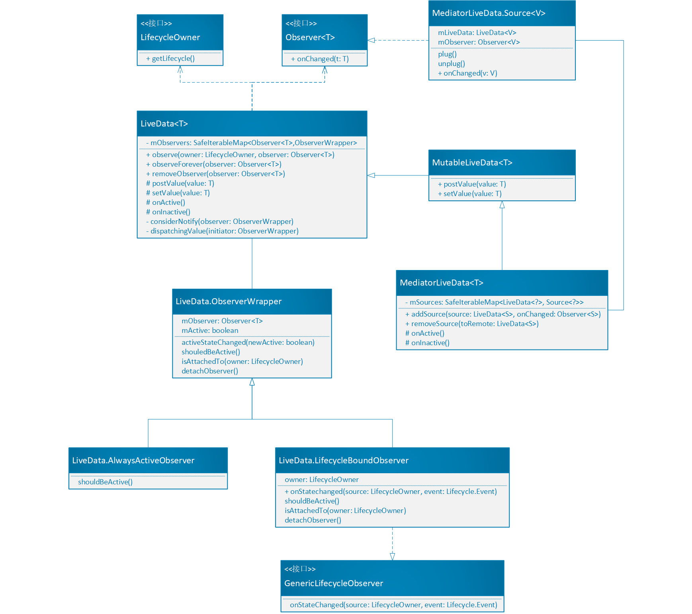

# 1. 什么是LiveData

LiveData 是一个基于**观察者模式**的数据容器。它具备如下特点：     
① 数据可以被观察者订阅

② 能够感知组件(Fragment、Activity、Service)的生命周期

③ 只有当组件处于活跃状态(STARTED或RESUMED)时才会通知观察者数据发生了变化

# 2. LiveData的优点

① UI和实时数据保持一致  
因为LiveData采用了观察者模式，LiveData是被观察者，所以当数据有变化时观察者（UI）就会获得通知，并进行更新。

② 避免内存泄漏  
当被绑定的组件处于DEDTROYED状态时，观察者对象会自动清理自身的数据。

③ 当Activity停止时不会引起崩溃  
当组件处于非激活状态时，它不会收到任何LiveData中数据变化的通知。

④ 不需要额外的处理来响应生命周期的变化   
LiveData可以自动感知被绑定的UI组件的生命周期，只有当UI组件处于活跃状态时才会通知数据变化。

⑤ 始终保持最新的数据     
当组件从不活跃状态变为活跃状态时总是可以收到最新的数据

⑥ 解决了Configuration change问题    
当Activity或Fragment由于配置变化（如用户旋转了设备屏幕）而被重新创建时，能够立刻收到最新的数据。

⑦ 资源共享    
我们可以实现一个单例模式的LiveData子类，并将系统服务封装在该类中。这样，任何需要这些系统服务的观察者就可以通过观察这个LiveData子类对象实现资源的共享。

# 3. LiveData的使用

1. 创建一个持有某种数据类型的LiveData对象        
2. 创建一个观察者对象，通常在UI Controller(如Activity或Fragment)中创建这个观察者。    
3. 将观察者对象作为参数传入LiveData.observe()方法，连接观察者和LiveData。

## 3.1 创建LiveData对象

````java
public class NameViewModel extends ViewModel {

    // Create a LiveData with a String
    private MutableLiveData<String> mCurrentName;
    public MutableLiveData<String> getCurrentName() {
          if (mCurrentName == null) {
              mCurrentName = new MutableLiveData<String>();
          }
          return mCurrentName;
    }

    // Rest of the ViewModel...
}
````

## 3.2 观察LiveData对象

通常情况下都是在组件的onCreate()方法中开始观察数据，原因有以下两点：  
① 系统会多次调用onResume()方法  
② 确保Activity或Fragment在处于活跃状态时立刻可以展示数据。

````java
public class NameActivity extends AppCompatActivity {

    private NameViewModel mModel;

    @Override
    protected void onCreate(Bundle savedInstanceState) {
        super.onCreate(savedInstanceState);

        // Other code to setup the activity...

        // Get the ViewModel.
        mModel = ViewModelProviders.of(this).get(NameViewModel.class);

        // Create the observer which updates the UI.
        final Observer<String> nameObserver = new Observer<String>() {
            @Override
            public void onChanged(@Nullable final String newName) {
                // Update the UI, in this case, a TextView.
                mNameTextView.setText(newName);
            }
        };

        // Observe the LiveData, passing in this activity as the LifecycleOwner and the observer.
        mModel.getCurrentName().observe(this, nameObserver);
    }
}
````
## 3.3 更新LiveData对象

LiveData没有提供可用的公共方法来更新其持有的数据，但是如果我们使用LiveData的子类`MutableLiveData`来存储数据，那么我们就可以使用它的公共方法`setValue()`和`postValue()`方法更新数据。这部分内容后续将详细说明。

````java
mButton.setOnClickListener(new OnClickListener() {
    @Override
    public void onClick(View v) {
        String anotherName = "John Doe";
        mModel.getCurrentName().setValue(anotherName);
    }
});
````

# 3.4 继承LiveData类
当然我们也可以通过继承LiveData定义自己的扩展类：
````java
public class StockLiveData extends LiveData<BigDecimal> {
    private StockManager mStockManager;

    private SimplePriceListener mListener = new SimplePriceListener() {
        @Override
        public void onPriceChanged(BigDecimal price) {
            setValue(price);
        }
    };

    public StockLiveData(String symbol) {
        mStockManager = new StockManager(symbol);
    }

    @Override
    protected void onActive() {
        mStockManager.requestPriceUpdates(mListener);
    }

    @Override
    protected void onInactive() {
        mStockManager.removeUpdates(mListener);
    }
}

public class MyFragment extends Fragment {
    @Override
    public void onActivityCreated(Bundle savedInstanceState) {
        super.onActivityCreated(savedInstanceState);
        LiveData<BigDecimal> myPriceListener = ...;
        myPriceListener.observe(this, price -> {
            // Update the UI.
        });
    }
}
````
自定义的StockLiveData实现了LiveData中的空方法`onActive()`和`onInactive()`。

# 4. 原理
## 4.1 数据发生变化时LiveData如何通知 Observer？
LiveData提供了两种添加观察者的方法：`observe()`和`observeForever()`：
````java
@MainThread
public void observe(@NonNull LifecycleOwner owner, @NonNull Observer<T> observer) {

    if (owner.getLifecycle().getCurrentState() == DESTROYED) {
        // ignore
        return;
    }

    //将LifecycleOwner对象和Observer对象封装成LifecycleBoundObserver对象
    LifecycleBoundObserver wrapper = new LifecycleBoundObserver(owner, observer);
    // mObservers是一个SafeIterableMap类型的数据容器，通过它的putIfAbsent()方法可以判断Observer对象是否已经与一个LifecycleBoundObserver对象关联
    ObserverWrapper existing = mObservers.putIfAbsent(observer, wrapper);
    if (existing != null && !existing.isAttachedTo(owner)) {
        throw new IllegalArgumentException("Cannot add the same observer with different lifecycles");
    }
    if (existing != null) {
        return;
    }

    //注册传入的观察者对象的生命周期监听
    owner.getLifecycle().addObserver(wrapper);
}

@MainThread
public void observeForever(@NonNull Observer<T> observer) {
    AlwaysActiveObserver wrapper = new AlwaysActiveObserver(observer);
    ObserverWrapper existing = mObservers.putIfAbsent(observer, wrapper);
    if (existing != null && existing instanceof LiveData.LifecycleBoundObserver) {
        throw new IllegalArgumentException("Cannot add the same observer with different lifecycles");
    }
    if (existing != null) {
        return;
    }
    wrapper.activeStateChanged(true);
}
````
如果通过`observeForever()`方法添加观察者，那么观察者会一直收到数据变化的回调通知；如果通过`observe()`方法添加，那么观察者只会在LifecycleOwner处于STARTED和RESUMED即active状态才会收到。

其中`observe()`方法内部使用了LifecycleBoundObserver类，`observeForever()`方法内部则使用了AlwaysActiveObserver类，它们都是抽象类ObserverWrapper的具体实现类。所以，我们先来看一下这个抽象类：

````java
private abstract class ObserverWrapper {
    final Observer<T> mObserver;
    boolean mActive;
    int mLastVersion = START_VERSION;

    ......

    void activeStateChanged(boolean newActive) {
        //新状态和之前状态相同则不做任何处理
        if (newActive == mActive) {
            return;
        }
        // 将当前状态设置为传入的newActive
        mActive = newActive;
        //处于active状态的观察者数量是否为0
        boolean wasInactive = LiveData.this.mActiveCount == 0;
        //如果当前状态为active状态，则处于active状态的观察者数量加1，否则减1
        LiveData.this.mActiveCount += mActive ? 1 : -1;
        //处于active状态的观察者个数从0变为1，回调LiveData的onActive()方法
        if (wasInactive && mActive) {
            onActive();
        }
        //处于active状态的观察者数量从1变为0，回调LiveData的onInactive()方法
        if (LiveData.this.mActiveCount == 0 && !mActive) {
            onInactive();
        }
        if (mActive) {
            dispatchingValue(this);
        }
    }
}
````

ObserverWrapper是Observer的封装类，在Observer的基础上增加了 mActive 和 mLastVersion 。其中mActive 用来标识观察者是否活跃，即它是否处于可用的生命周期内。   

`onActiveStateChanged()`方法定义了观察者在活跃状态和非活跃状态之间转换时的处理逻辑，如果ObserverWrapper对象处于活跃状态，那么LiveData中的mActiveCount 计数会加一，否则会减一。紧接着，`onActive()`方法会在mActiveCount为1时触发，`onInactive()`方法则会在mActiveCount为0时触发。最后，如果ObserverWrapper对象处于活跃状态，还会调用 `dispatchingValue()`方法发送新的数据。

````java
private void dispatchingValue(@Nullable ObserverWrapper initiator) {

    //如果mDispatchingValue为true，则将mDispatchInvalidated设为true并直接返回
    if (mDispatchingValue) {
        mDispatchInvalidated = true;
        return;
    }

    mDispatchingValue = true;
    do {
        mDispatchInvalidated = false;
        if (initiator != null) {
            considerNotify(initiator);
            initiator = null;
        } else {
            for (Iterator<Map.Entry<Observer<T>, ObserverWrapper>> iterator =mObservers.iteratorWithAdditions(); iterator.hasNext(); ) {
                considerNotify(iterator.next().getValue());
                if (mDispatchInvalidated) {
                    break;
                }
            }
        }
    } while (mDispatchInvalidated);
    mDispatchingValue = false;
}
````

其中，mDispatchingValue和mDispatchInvalidated变量是为了防止重复分发。该方法会循环遍历mObservers 这个集合，并通过调用`considerNotify()`方法为每一个处于活跃状态且数据未更新的观察者发送数据。

````java
private void considerNotify(ObserverWrapper observer) {
    if (!observer.mActive) {
        return;
    }
    if (!observer.shouldBeActive()) {
        observer.activeStateChanged(false);
        return;
    }
    if (observer.mLastVersion >= mVersion) {
        return;
    }
    observer.mLastVersion = mVersion;
    observer.mObserver.onChanged((T) mData);
}
````

现在我们再来分析LifecycleBoundObserver类和AlwaysActiveObserver类。我们先看LifecycleBoundObserver：
````java
class LifecycleBoundObserver extends ObserverWrapper implements GenericLifecycleObserver {

    @NonNull final LifecycleOwner mOwner;

    LifecycleBoundObserver(@NonNull LifecycleOwner owner, Observer<T> observer) {
        super(observer);
        mOwner = owner;
    }

     //判断是否处于active状态
    @Override
    boolean shouldBeActive() {
        return mOwner.getLifecycle().getCurrentState().isAtLeast(STARTED);
    }

    //当LifecycleOwner生命周期发生变化时会回调该方法
    @Override
    public void onStateChanged(LifecycleOwner source, Lifecycle.Event event) {
        //如果当前处于DESTROYED状态，则会自动移除观察者
        if (mOwner.getLifecycle().getCurrentState() == DESTROYED) {
            removeObserver(mObserver);
            return;
        }
        //调用ObserverWrapper的activeStateChanged()方法，将当前是否处于active状态的判断结果作为参数传入
        activeStateChanged(shouldBeActive());
    }

    @Override
    boolean isAttachedTo(LifecycleOwner owner) {
        return mOwner == owner;
    }

    @Override
    void detachObserver() {
        mOwner.getLifecycle().removeObserver(this);
    }
}
````
可以看出，LifecycleBoundObserver 把 ObserverWrapper 和 Lifecycle 结合在了一起。因此LiveData就可以获取到观察者的生命周期，当观察者的生命周期可用时，LiveData 会把数据发送给观察者，而当观察者生命周期不可用的时，即` owner.getLifecycle().getCurrentState() == DESTROYED` ，LiveData 就选择不发送并且自动解绑，防止内存泄漏。

AlwaysActiveObserver顾名思义观察者的生命周期一直可用，所以它和LifecycleOwner的生命周期无关，当数据改变时不管LifecycleOwner处于什么状态都会收到回调通知，除非手动将这个观察者移除。从AlwaysActiveObserver的源码也可以看出，它通过`shouldBeActive()`方法将自己的生命周期设为一直可用，LiveData的`observeForever()`方法内部使用的就是AlwaysActiveObserver。
````java
private class AlwaysActiveObserver extends ObserverWrapper {

    AlwaysActiveObserver(Observer<T> observer) {
        super(observer);
    }

    @Override
    boolean shouldBeActive() {
        return true;
    }
}
````
## 4.2 LiveData中的数据如何更新？
那么怎么改变LiveData中持有的数据呢？LiveData提供了两种方法——`postValue()`和`setValue()`：
````java
@MainThread
protected void setValue(T value) {
    //判断当前线程是否是主线程，不是主线程就抛出异常
    assertMainThread("setValue");
    //版本更新
    mVersion++;
    //改变LiveData持有的数据
    mData = value;
    //将新的数据分发给订阅该LiveData所有的观察者们
    dispatchingValue(null);
}

protected void postValue(T value) {
    boolean postTask;
    synchronized (mDataLock) {
        postTask = mPendingData == NOT_SET;
        mPendingData = value;
    }
    if (!postTask)  return;
    //在主线程中执行mPostValueRunnable中的内容
    ArchTaskExecutor.getInstance().postToMainThread(mPostValueRunnable);
}

private final Runnable mPostValueRunnable = new Runnable() {
    @Override
    public void run() {
        Object newValue;
        synchronized (mDataLock) {
            newValue = mPendingData;
            mPendingData = NOT_SET;
    }
    setValue((T) newValue);
    }
};
````
它们的区别是`setValue()`方法要在主线程中调用，而`postValue()`方法既可在主线程也可在子线程中调用。这是因为`postValue()`方法则通过ArchTaskExecutor将mPostValueRunnable运行在主线程，而在mPostValueRunnable中最终会调用`setValue()`方法来实现改变LiveData存储的数据。

但是我们发现LiveData并没有将这两个方法对外公开，好在我们可以通过LiveData的子类MutableLiveData实现数据的修改，其源码如下：

````java
public class MutableLiveData<T> extends LiveData<T> {
    @Override
    public void postValue(T value) {
        super.postValue(value);
    }

    @Override
    public void setValue(T value) {
        super.setValue(value);
    }
}
````
LiveData还有一个子类MediatorLiveData，它可以看成多个LiveData的代理。它定义了一个内部类Source，用于封装LiveData和Observer，这样如果多个LiveData被添加到MediatorLiveData中，那么任何一个LiveData数据发生变化时，MediatorLiveData的观察者都会收到通知。Source的源码如下：
````java
private static class Source<V> implements Observer<V> {
    final LiveData<V> mLiveData;
    final Observer<V> mObserver;
    int mVersion = START_VERSION;

    Source(LiveData<V> liveData, final Observer<V> observer) {
        mLiveData = liveData;
        mObserver = observer;
    }

    void plug() {
        mLiveData.observeForever(this);
    }

    void unplug() {
        mLiveData.removeObserver(this);
    }

    @Override
    public void onChanged(@Nullable V v) {
        if (mVersion != mLiveData.getVersion()) {
            mVersion = mLiveData.getVersion();
            mObserver.onChanged(v);
        }
    }
}
````
通过一个简单的应用场景可以更加清楚地说明MediatorLiveData的作用。例如，一个Activity界面的UI数据依赖于网络数据源和数据库数据，因此会有两个LiveData。使用MediatorLiveData将两个LiveData合并后，Activity只需观察一个MediatorLiveData即可。无论何时，只要任何一个LiveData数据源发生变化，都会通知Activity的UI进行更新。


# 5. 总结
下图给出了LiveData所涉及的主要相关类：



和LiveData组件相关的类和接口有：LiveData类、Observer接口、GenericLifecycleObserver接口和LifecycleOwner接口。最后，还是对图中相关的接口和类做一个简单的总结。
- LiveData是个抽象类，MediatorLiveData继承自MutableLiveData，MutableLiveData则继承自LiveData。MediatorLiveData可以看成是多个LiveData的代理，MutableLiveData则是提供了可以修改LiveData中数据的对外公开方法。
- LiveData有3个内部类ObserverWrapper、AlwaysActiveObserver和LifecycleBoundObserver，其中后两个类都是ObserverWrapper的子类。LifecycleBoundObserver实现了GenericLifecycleObserver接口，当LifecycleOwner的生命周期变化时就会通过该接口的onStateChanged()方法回调回来。
- Observer接口就是观察者，它定义了LiveData数据变化的回调方法onChanged()。MediatorLiveData的内部类Source实现了该接口。
