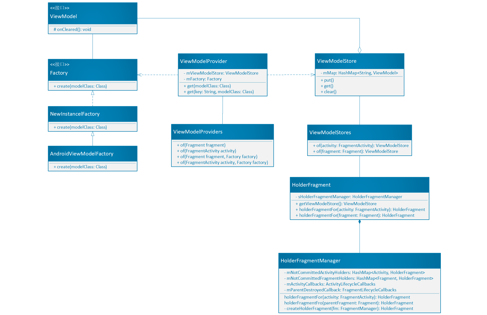

# 1. 什么是ViewModel    
ViewModel是用来管理和UI相关的数据的，它将视图（View）的数据（Model）和逻辑从具有生命周期特性的实体（如Activity或Fragment）中剥离开来，这是因为：

① 由于Activity或Fragment会被系统随时销毁或重新创建，因此任何存放在这里的数据都可能会丢失，而 onSaveInstanceState()只适合保存少量的用户数据。

② UI组件会频繁的调用异步回调，这些回调可能会非常耗时。这就需要UI组件管理这些调用，并且在UI组件销毁时清除这些调用。这会花费很多的维护成本，而且当UI由于配置变化重新创建时又需要重新调用，造成资源浪费（例如网络请求）。

③ UI组件的设计初衷是用来展示数据、与用户交互或处理与操作系统的通信（如请求权限）。如果将数据加载的功能也放在UI组件中会使这部分代码变得臃肿，而且也不利于后续的测试。

# 2. ViewModel的使用
假设一个App需要展示一个用户列表，那么要在ViewModel中实现用户数据的获取和保存，而不应该在Activity或Fragment中进行实现。示例代码如下：

````java
public class MyViewModel extends ViewModel {
    private MutableLiveData<List<User>> users;
    public LiveData<List<User>> getUsers() {
        if (users == null) {
            users = new MutableLiveData<List<User>>();
            loadUsers();
        }
        return users;
    }

    private void loadUsers() {
        // Do an asynchronous operation to fetch users.
    }
}
````
Activity访问用户数据的示例代码如下：
````java
public class MyActivity extends AppCompatActivity {
    public void onCreate(Bundle savedInstanceState) {
        // Create a ViewModel the first time the system calls an activity's onCreate() method.
        // Re-created activities receive the same MyViewModel instance created by the first activity.

        MyViewModel model = ViewModelProviders.of(this).get(MyViewModel.class);
        model.getUsers().observe(this, users -> {
            // update UI
        });
    }
}
````

# 3. ViewModel生命周期
下面这张图很好地描述了当Activity被重新创建时ViewModel的生命周期。


左侧表示Activity的生命周期状态，右侧绿色部分表示ViewModel的生命周期范围。当屏幕旋转的时候，Activity会被重新创建，Activity会经过几个生命周期方法，但是这个时候ViewModel还是之前的对象，并没有被重新创建，只有当Activity的finish()方法被调用时，ViewModel.onCleared()方法会被调用，ViewModel对象才会被销毁。

# 4. 用于Fragment之间的数据通信
有时候一个Activity中的两个或多个Fragment需要进行数据通信，这样就会带来很多问题，比如实现定义这些Fragment之间的通信接口、主Activity绑定这些Fragment等复杂的操作。而使用ViewModel可以很好地解决这些问题。假设有这样两个Fragment，一个用来提供列表，另一个用来提供点击每个item后显示的详细信息。

````java
public class SharedViewModel extends ViewModel {
    private final MutableLiveData<Item> selected = new MutableLiveData<Item>();

    public void select(Item item) {
        selected.setValue(item);
    }

    public LiveData<Item> getSelected() {
        return selected;
    }
}


public class MasterFragment extends Fragment {
    private SharedViewModel model;
    public void onCreate(Bundle savedInstanceState) {
        super.onCreate(savedInstanceState);
        model = ViewModelProviders.of(getActivity()).get(SharedViewModel.class);
        itemSelector.setOnClickListener(item -> {
            model.select(item);
        });
    }
}

public class DetailFragment extends Fragment {
    public void onCreate(Bundle savedInstanceState) {
        super.onCreate(savedInstanceState);
        SharedViewModel model = ViewModelProviders.of(getActivity()).get(SharedViewModel.class);
        model.getSelected().observe(this, item -> {
           // Update the UI.
        });
    }
}
````

两个Fragment都是通过getActivity()来获取ViewModelProvider的，因此它们获取的都是属于同一个Activity的同一个ShareViewModel实例。这样做的好处是：    
① Activity不需要写任何额外的代码，也不需要关心Fragment之间的通信。     
② 这两个Fragment都不需要知道对方的存在。
③ Fragment之间的生命周期互不影响。

# 5. 原理
## 5.1 ViewModel的创建
在上述ViewModel的使用中我们可以看到ViewModel的创建语句非常简单：
````java
MyViewModel model = ViewModelProviders.of(this).get(MyViewModel.class);
`````
下面，我将通过源码分析这行代码的工作原理。首先，ViewModelProviders类的源码如下所示：

````java
public class ViewModelProviders {

    //通过Activity获取可用的Application对象
    private static Application checkApplication(Activity activity) {
        Application application = activity.getApplication();
        if (application == null) {
            throw new IllegalStateException("Your activity/fragment is not yet attached to "
                    + "Application. You can't request ViewModel before onCreate call.");
        }
        return application;
    }

    //通过Fragment获取Activity
    private static Activity checkActivity(Fragment fragment) {
        Activity activity = fragment.getActivity();
        if (activity == null) {
            throw new IllegalStateException("Can't create ViewModelProvider for detached fragment");
        }
        return activity;
    }

    @NonNull
    @MainThread
    public static ViewModelProvider of(@NonNull Fragment fragment) {
        //获取ViewModelProvider内部类AndroidViewModelFactory的实例，AndroidViewModelFactory是一个单例类
        ViewModelProvider.AndroidViewModelFactory factory =
                ViewModelProvider.AndroidViewModelFactory.getInstance(checkApplication(checkActivity(fragment)));
        return new ViewModelProvider(ViewModelStores.of(fragment), factory);
    }

    @NonNull
    @MainThread
    public static ViewModelProvider of(@NonNull FragmentActivity activity) {
        ViewModelProvider.AndroidViewModelFactory factory =
                ViewModelProvider.AndroidViewModelFactory.getInstance(checkApplication(activity));
        return new ViewModelProvider(ViewModelStores.of(activity), factory);
    }

    @NonNull
    @MainThread
    public static ViewModelProvider of(@NonNull Fragment fragment, @NonNull Factory factory) {
        checkApplication(checkActivity(fragment));
        return new ViewModelProvider(ViewModelStores.of(fragment), factory);
    }

    @NonNull
    @MainThread
    public static ViewModelProvider of(@NonNull FragmentActivity activity,
            @NonNull Factory factory) {
        checkApplication(activity);
        return new ViewModelProvider(ViewModelStores.of(activity), factory);
    }

}
````
ViewModelProviders提供了4个of()方法获得ViewModelProvider对象，其中`of(FragmentActivity activity, Factory factory)`和`of(Fragment fragment, Factory factory)`使用了自定义的方法创建ViewModel，而其他两个方法则通过ViewModelProvider 的静态内部类AndroidViewModelFactory创建，这是一个单例类，其源码如下：
````java
public static class AndroidViewModelFactory extends ViewModelProvider.NewInstanceFactory {

        private static AndroidViewModelFactory sInstance;

        //单例实现
        @NonNull
        public static AndroidViewModelFactory getInstance(@NonNull Application application) {
            if (sInstance == null) {
                sInstance = new AndroidViewModelFactory(application);
            }
            return sInstance;
        }

        private Application mApplication;
        //构造函数
        public AndroidViewModelFactory(@NonNull Application application) {
            mApplication = application;
        }

        //ViewModel的创建方法
        @NonNull
        @Override
        public <T extends ViewModel> T create(@NonNull Class<T> modelClass) {
            if (AndroidViewModel.class.isAssignableFrom(modelClass)) {
                try {
                    //根据给出的Class反射创建需要的ViewModel
                    return modelClass.getConstructor(Application.class).newInstance(mApplication);
                } catch
                ...
            }
            return super.create(modelClass);
        }
    }
````
所以AndroidViewModelFactory工具类的作用就是通过反射创建需要的ViewModel。回到ViewModelProviders.of()方法，我们发现这四个方法都调用了ViewModelProvider的构造函数`new ViewModelProvider(ViewModelStores.of(activity/fragment), factory)`，其中第二个参数就是用来创建ViewModel的工具类，那么第一个参数的作用是什么呢？我们还是看一下ViewModelStores.of()方法的源码：
````java
@NonNull
@MainThread
public static ViewModelStore of(@NonNull FragmentActivity activity) {
        if (activity instanceof ViewModelStoreOwner) {
            return ((ViewModelStoreOwner) activity).getViewModelStore();
        }
        return holderFragmentFor(activity).getViewModelStore();
    }

@NonNull
@MainThread
public static ViewModelStore of(@NonNull Fragment fragment) {
        if (fragment instanceof ViewModelStoreOwner) {
            return ((ViewModelStoreOwner) fragment).getViewModelStore();
        }
        return holderFragmentFor(fragment).getViewModelStore();
}
````
原来第一个参数是一个ViewModelStore对象，它通过ViewModelStores.of()方法得到。那么ViewModelStore又是用来做什么的呢？其源码如下：
````java
public class ViewModelStore {

    private final HashMap<String, ViewModel> mMap = new HashMap<>();

    final void put(String key, ViewModel viewModel) {
        ViewModel oldViewModel = mMap.put(key, viewModel);
        if (oldViewModel != null) {
            oldViewModel.onCleared();
        }
    }

    final ViewModel get(String key) {
        return mMap.get(key);
    }

   //Clears internal storage and notifies ViewModels that they are no longer used.
    public final void clear() {
        for (ViewModel vm : mMap.values()) {
            vm.onCleared();
        }
        mMap.clear();
    }
}
````
显然，ViewModelStore是一个存储ViewModel的类，具体则是通过HashMap实现的。它提供了3个方法：put()，get()和clear()。put()和get()方法用于存取ViewModel对象，clear()方法则用于清空缓存的ViewModel对象，该方法还会调用ViewModel的onCleared()方法来通知ViewModel对象不再被使用。

得到了ViewModelProvider对象后就可以进一步通过ViewModelProvider.get()方法获取ViewModel对象，该方法的源码如下：

````java
@NonNull
@MainThread
public <T extends ViewModel> T get(@NonNull Class<T> modelClass) {
    String canonicalName = modelClass.getCanonicalName();
    if (canonicalName == null) {
        throw new IllegalArgumentException("Local and anonymous classes can not be ViewModels");
    }
    return get(DEFAULT_KEY + ":" + canonicalName, modelClass);
}

@NonNull
@MainThread
public <T extends ViewModel> T get(@NonNull String key, @NonNull Class<T> modelClass) {

    //先从ViewModelStore中查找是否存在相应的ViewModel对象
    ViewModel viewModel = mViewModelStore.get(key);
    if (modelClass.isInstance(viewModel)) {
        return (T) viewModel;
    } else {
        if (viewModel != null) {
            // TODO: log a warning.
        }
    }

    //没有则创建ViewModel对象，并缓存到ViewModelStore中
    viewModel = mFactory.create(modelClass);
    mViewModelStore.put(key, viewModel);

    return (T) viewModel;
}
````
首先从 mViewModelStore 中使用DEFATULT_KEY和类名组成的key值去获取 ViewModel对象，如果获取到就直接返回。否则，使用单例工具类对象mFactory的create()方法创建，然后将key值和ViewModel对象以键值对的形式存入mViewModelStore中，并返回这个新建的ViewModel对象。

综上所述，ViewModel的整体创建流程如下：
`使用ViewModelProviders.of()方法创建一个ViewModelProvider对象` -> `使用ViewModelProvider内部的全局单例类AndroidViewModelFactory或自定义的Factory来反射创建ViewModel` -> `把创建的ViewModel存放到传入的ViewModelStore中`。

## 5.2 ViewModel的存储
在5.1节我们已经知道ViewModel是通过ViewModelStore存储的，而且ViewModelStore对象是通过ViewModelStores.of()方法获取的。如果当前Activity或Fragment实现了ViewModelStoreOwner接口则可以直接返回一个ViewModelStore对象，但是通常我们的Activity或Fragment都不会去实现这个接口。所以，系统就会为它们注入一个HolderFragment，这是一个实现了上述接口的Fragment，而且自身持有一个ViewModelStore对象。注入方法为HolderFragment.holderFragmentFor()：
````java
public static HolderFragment holderFragmentFor(FragmentActivity activity) {
    return sHolderFragmentManager.holderFragmentFor(activity);
}

public static HolderFragment holderFragmentFor(Fragment fragment) {
    return sHolderFragmentManager.holderFragmentFor(fragment);
}
````
这是一个封装方法，具体则是通过调用自己内部类HolderFragmentManager的holderFragmentFor()方法实现：
````java
HolderFragment holderFragmentFor(FragmentActivity activity) {

    FragmentManager fm = activity.getSupportFragmentManager();
    HolderFragment holder = findHolderFragment(fm);
    if (holder != null)  return holder;

    //以当前activity为key从Map缓存中获取HolderFragment，如果存在则直接返回，因此每个activity只会有一个HolderFragment
    holder = mNotCommittedActivityHolders.get(activity);
    if (holder != null)    return holder;

    //注册Activity生命周期回调监听，在Activity销毁时能够移除Map中对应的数据
    if (!mActivityCallbacksIsAdded) {
        mActivityCallbacksIsAdded = true;
        activity.getApplication().registerActivityLifecycleCallbacks(mActivityCallbacks);
    }
    //创建HolderFragment对象
    holder = createHolderFragment(fm);
    //添加到Map缓存
    mNotCommittedActivityHolders.put(activity, holder);
    return holder;
}

HolderFragment holderFragmentFor(Fragment parentFragment) {

    FragmentManager fm = parentFragment.getChildFragmentManager();
    HolderFragment holder = findHolderFragment(fm);
    if (holder != null)    return holder;

    //以当前fragment为key从Map缓存中获取HolderFragment，如果存在则直接返回，因此每个Fragment只会有一个HolderFragment
    holder = mNotCommittedFragmentHolders.get(parentFragment);
    if (holder != null)    return holder;

    //注册Fragment生命周期回调监听，在Fragment销毁时能够移除Map中对应的数据
    parentFragment.getFragmentManager().registerFragmentLifecycleCallbacks(mParentDestroyedCallback, false);
    holder = createHolderFragment(fm);
    mNotCommittedFragmentHolders.put(parentFragment, holder);
    return holder;
}
````

对于一个新的Activity或Fragment，HolderFragment是通过createHolderFragment()方法创建的：
````java
private static HolderFragment createHolderFragment(FragmentManager fragmentManager) {
    HolderFragment holder = new HolderFragment();
    fragmentManager.beginTransaction().add(holder, HOLDER_TAG).commitAllowingStateLoss();
    return holder;
}
````
该方法调用了HolderFragment的构造函数：
````java
public HolderFragment() {
    setRetainInstance(true);
}
````
其中setRetainInstance()方法是Fragment类的一个方法，将这个方法的参数设置为true可以使得当前Fragment所属的Activity被重建时该Fragment却不会被重新创建。

把需要创建ViewModel的Activity或Fragment绑定到一个HolderFragment上，ViewModel会被存放到HolderFragment持有的ViewModelStore中。这样，当Activity或者Fragment因为配置改变而重建时，HolderFragment存活了下来，所以之前创建的ViewModel也得以存活，这也解释了为什么ViewModel的生命周期会比创建它的Activity或Fragment更长。

# 6. 总结
下图给出了ViewModel涉及到的主要相关类和接口：



对这些类和接口做一个简单的总结：
- ViewModel是个抽象类，里面只定义了一个onCleared()方法，该方法在ViewModel不再被使用时调用。
- ViewModelProviders是ViewModel工具类，该类提供了通过Fragment和Activity得到ViewModel的方法，而具体实现又是由ViewModelProvider实现的。ViewModelProvider是获取ViewModel对象的工具类。ViewModelProvider定义了一个创建ViewModel的接口——Factory，和实现该接口的两个内部类NewInstanceFactory和AndroidModelFactory。ViewModelProvider中还有一个ViewModelStore对象，用于存储ViewModel。
- ViewModelStore是存储ViewModel的类，具体则是通过HashMap来实现。ViewModelStores是ViewModelStore的工厂方法类，它会关联HolderFragment，HolderFragment有个嵌套类——HolderFragmentManager。
