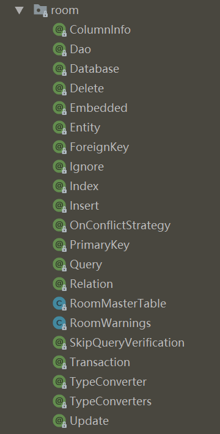
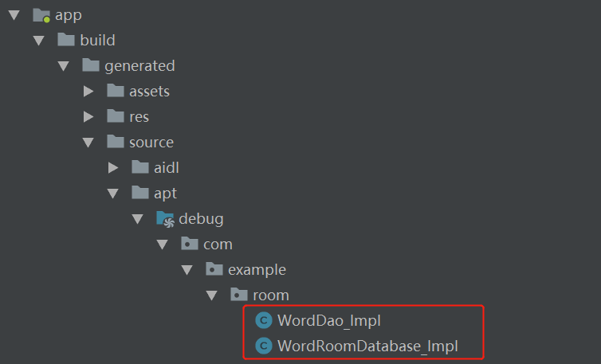
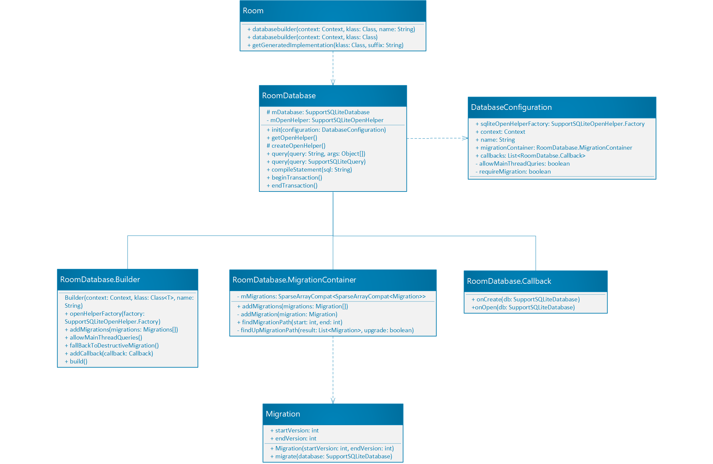

# 1. Overview
App把经常需要访问的数据存储在本地将会大大改善用户的体验，这样用户在网络不好时仍然可以浏览内容，当用户网络可用时再更新数据。自从最早版本开始，Android 就提供了SQLite数据库，但是直接使用SQLite存在以下两个缺点：
- 没有编译时SQL语句的检查。尤其是当数据库表发生变化时，需要手动更新相关代码，这个过程不仅耗时而且容易出错。
- 需要编写大量SQL语句和Java对象之间相互转化的代码。

因此，Google推出了一款简洁易用的对象映射层——Room来解决上述问题。Room在SQLite的基础上提供了一个方便访问的抽象层，不仅保留了SQLite 强大的功能，而且避免了很多重复编码的工作。Room还支持LiveData数据返回，从而提供可观测的数据库，可以动态地将数据库中的数据变化自动更新到LiveData上，再通过LiveData自动刷新到UI上。

Room由以下三个部分组成：

- **Database**：标识所需要创建的数据库。

- **Entity**： 代表了持有数据库表记录的类。Room会创建一个数据库表来持有每个实体的成员变量，如果存在不想被持久化的成员变量则将其注解为`@Ignore`。

- **DAO**：即Database Access Object，定义了访问数据库的方法。

它们和App中其余部分的关系如下图所示：


# 2. 使用方法

以存储单词为例进行介绍。

## 2.1 定义实体类
````java
@Entity(tableName = "word_table")
public class Word {

    @PrimaryKey
    @NonNull
    @ColumnInfo(name = "word")
    private String word;

    public Word(@NonNull String word) {
        this.word = word;
    }

    public String getWord() {
        return word;
    }
}
````
顶部使用注解`@Entity`声明这是一个实体类，为了持久化成员变量，Room 必须可以访问它，所以成员变量要么是公共的要么就提供 getter和setter 方法。`@Entity`注解的tableName属性定义了这个实体类对应的数据库表名。如果不写，那么默认类名就是表名。

# 2.2 定义数据访问对象
````java
@Dao
public interface WordDao {
    @Insert
    void insert(Word word);

    @Query("DELETE FROM word_table")
    void deleteAll();

    @Query("SELECT * FROM word_table ORDER BY word ASC")
    LiveData<List<Word>> getAllWords();
}
````
顶部使用注解`@Dao`声明这是一个DAO类，数据库的CRUD 操作全部使用注解声明，具体 sql 语句的也是直接写在注解`@Query`中，如果sql语句存在书写或语法错误，Room可以在编译阶段检测出来。Dao可以是一个接口也可以是一个抽象类，如果是抽象类，那么它可以接受一个RoomDatabase作为构造器的唯一参数。这里我将其定义为一个接口。

## 2.3 定义数据库抽象类
````java
@Database(entities = {Word.class}, version = 1)
public abstract class WordRoomDatabase extends RoomDatabase {
    public abstract WordDao wordDao();
}
````
顶部使用注解`@Database`声明这是一个数据库类，其中entities属性声明该数据库包含哪些实体从而创建相应的数据库表，version属性则声明了该数据库的版本号。该类还需要定义获得与数据库关联的实体所对应的Dao对象。

## 2.4 创建数据库
````java
@Database(entities = {Word.class}, version = 1)
public abstract class WordRoomDatabase extends RoomDatabase {

    public abstract WordDao wordDao();

    //单例模式
    private static WordRoomDatabase INSTANCE;
    public static WordRoomDatabase getDatabse(final Context context) {
        if (INSTANCE == null) {
            synchronized (WordRoomDatabase.class) {
                if (INSTANCE == null) {
                    INSTANCE = Room.databaseBuilder(context.getApplicationContext(), WordRoomDatabase.class, "word_database")
                            .build();
                }
            }
        }
        return INSTANCE;
    }
}
````
这里将数据库的创建直接放在了WordRoomDatabase类中，核心代码就是`Room.databaseBuilder(context.getApplicationContext(), WordRoomDatabase.class, "word_database").build()`。目的是为了将WordRoomDatabase封装成一个单例类，这样在任何地方需要操作该数据库操作时，都可以通过方法`getDatabase()`直接获得全局唯一的数据库使用，而不是重新创建。

# 3. Room的工作原理
我们从`Room.databaseBuilder(context.getApplicationContext(), WordRoomDatabase.class, "word_database").build()`这条语句入手来进行分析。

这一行代码传递了以下几个信息：
① Room是通过**建造者模式（Builder pattern）** 来获取数据库实例的。
② Builder需要传入3个参数，第1个参数为context，第3个参数为数据库的名字。而第2个参数比较特别，是一个Class对象，对应的就是所需创建的数据库类。这是不是意味者Room还用到了反射机制呢？我们看一看Room的部分源码：

````java
@NonNull
public static <T extends RoomDatabase> RoomDatabase.Builder<T> databaseBuilder(
            @NonNull Context context, @NonNull Class<T> klass, @NonNull String name) {
    if (name == null || name.trim().length() == 0) {
        throw new IllegalArgumentException("Cannot build a database with null or empty name."
                    + " If you are trying to create an in memory database, use Room.inMemoryDatabaseBuilder");
    }
    return new RoomDatabase.Builder<>(context, klass, name);
}

@NonNull
public static <T extends RoomDatabase> RoomDatabase.Builder<T> inMemoryDatabaseBuilder(
            @NonNull Context context, @NonNull Class<T> klass) {
    return new RoomDatabase.Builder<>(context, klass, null);
}
````

原来RoomDatabase.Builder对象不仅可以通过`databaseBuilder()`方法获得，还可以使用`inMemoryDatabase()`方法。二者的区别是：`inMemoryDatabase()`方法少了一个数据库名作为参数，从方法名可以看出它创建的是一个临时的数据库。

重点看一下RoomDatabase.Builder的源码实现：

````java
public static class Builder<T extends RoomDatabase> {
    private final Class<T> mDatabaseClass;
    private final String mName;
    private final Context mContext;
    private ArrayList<Callback> mCallbacks;

    private SupportSQLiteOpenHelper.Factory mFactory;
    private boolean mAllowMainThreadQueries;
    private boolean mRequireMigration;
    //数据库升级辅助类
    private MigrationContainer mMigrationContainer;

    Builder(@NonNull Context context, @NonNull Class<T> klass, @Nullable String name) {
        mContext = context;
        mDatabaseClass = klass;
        mName = name;
        mRequireMigration = true;
        mMigrationContainer = new MigrationContainer();
    }

    //设置数据库工厂，若不设置则默认为FrameworkSQLiteOpenHelperFactory
    @NonNull
    public Builder<T> openHelperFactory(@Nullable SupportSQLiteOpenHelper.Factory factory) {
        mFactory = factory;
        return this;
    }

    //添加Migration对象，指明数据库从一个版本升级到另一个版本
    @NonNull
    public Builder<T> addMigrations(Migration... migrations) {
        mMigrationContainer.addMigrations(migrations);
        return this;
    }

    //是否允许在主线程访问数据库
    @NonNull
    public Builder<T> allowMainThreadQueries() {
        mAllowMainThreadQueries = true;
        return this;
    }

    //如果数据库升级发生错误，则重新创建数据库，而不是直接崩溃
    @NonNull
    public Builder<T> fallbackToDestructiveMigration() {
        mRequireMigration = false;
        return this;
    }

    //添加回调
    @NonNull
    public Builder<T> addCallback(@NonNull Callback callback) {
        if (mCallbacks == null) {
            mCallbacks = new ArrayList<>();
        }
        mCallbacks.add(callback);
        return this;
    }

    //创建并初始化数据库
    @NonNull
    public T build() {

        if (mContext == null) {
            throw new IllegalArgumentException("Cannot provide null context for the database.");
        }

        if (mDatabaseClass == null) {
            throw new IllegalArgumentException("Must provide an abstract class that extends RoomDatabase");
        }

        if (mFactory == null) {
            mFactory = new FrameworkSQLiteOpenHelperFactory();
        }

        DatabaseConfiguration configuration = new DatabaseConfiguration(mContext, mName, mFactory,
                      mMigrationContainer, mCallbacks, mAllowMainThreadQueries, mRequireMigration);

        //Room的getGeneratedImplementation()方法通过反射机制创建数据库
        T db = Room.getGeneratedImplementation(mDatabaseClass, DB_IMPL_SUFFIX);
        //数据库初始化
        db.init(configuration);
        return db;
    }
}
````
RoomDatabase.Builder每个方法的作用都在注释里作了说明，其中`build()`最终是通过调用`Room.getGeneratedImplementation()`方法来生成数据库实例的，那我们再来看看这个方法的源码：

````java
@NonNull
static <T, C> T getGeneratedImplementation(Class<C> klass, String suffix) {
    final String fullPackage = klass.getPackage().getName();
    String name = klass.getCanonicalName();
    final String postPackageName = fullPackage.isEmpty() ? name: (name.substring(fullPackage.length() + 1));
    final String implName = postPackageName.replace('.', '_') + suffix;
    try {

        final Class<T> aClass = (Class<T>) Class.forName(
                    fullPackage.isEmpty() ? implName : fullPackage + "." + implName);
        return aClass.newInstance();

    } catch (ClassNotFoundException e) {
        throw new RuntimeException("cannot find implementation for "
                    + klass.getCanonicalName() + ". " + implName + " does not exist");
    } catch (IllegalAccessException e) {
        throw new RuntimeException("Cannot access the constructor"
                    + klass.getCanonicalName());
    } catch (InstantiationException e) {
        throw new RuntimeException("Failed to create an instance of "
                    + klass.getCanonicalName());
    }
}
````
很明显，这个方法就是通过反射机制得到数据库实例的。有意思的是，它先对`RoomDatabase.Builder()`方法传入的xxx.class进行了扩展，然后再基于这个扩展的xxx_Impl.class反射获取实例。

这是因为Room要求我们定义的数据库类为抽象类即可，但是抽象类是无法直接实例化的，所以Room在编译阶段帮我们做了大量的工作，包括实现这个抽象类。那这个实现类是如何生成的呢？注意到我们在使用Room框架时使用了大量的注解，下图列出了Room中声明的所有注解类：



所以Room的核心就是基于注解在编译阶段自动生成相关代码，具体的逻辑则完全由Android的APT工具——annotationProcessor依赖注入实现。

**APT** (Annotation Processing Tool) 即注解处理器，是一种处理注解的工具，用来在编译时扫描和处理注解。注解处理器以Java代码(或者编译过的字节码)作为输入，生成.java文件作为输出。我们编译基于Room开发的项目，会发现在`app/build/generated/source/apt/debug`目录下Room为我们生成好了接口WordDao和抽象类WordRoomDatabase的具体实现类。



为什么会多出一个WordDao_Impl类呢？我们还是先分析WordDao_Impl类的代码：

````java
public class WordRoomDatabase_Impl extends WordRoomDatabase {
  private volatile WordDao _wordDao;

  protected SupportSQLiteOpenHelper createOpenHelper(DatabaseConfiguration configuration) {
    final SupportSQLiteOpenHelper.Callback _openCallback = new RoomOpenHelper(configuration, new RoomOpenHelper.Delegate(1) {
      public void createAllTables(SupportSQLiteDatabase _db) {
        _db.execSQL("CREATE TABLE IF NOT EXISTS `word_table` (`word` TEXT NOT NULL, PRIMARY KEY(`word`))");
        _db.execSQL("CREATE TABLE IF NOT EXISTS room_master_table (id INTEGER PRIMARY KEY,identity_hash TEXT)");
        _db.execSQL("INSERT OR REPLACE INTO room_master_table (id,identity_hash) VALUES(42, \"d35b8f1bacddbbdac6402852f1af929f\")");
      }

      public void dropAllTables(SupportSQLiteDatabase _db) {
        _db.execSQL("DROP TABLE IF EXISTS `word_table`");
      }

      protected void onCreate(SupportSQLiteDatabase _db) {
        if (mCallbacks != null) {
          for (int _i = 0, _size = mCallbacks.size(); _i < _size; _i++) {
            mCallbacks.get(_i).onCreate(_db);
          }
        }
      }

      public void onOpen(SupportSQLiteDatabase _db) {
        mDatabase = _db;
        internalInitInvalidationTracker(_db);
        if (mCallbacks != null) {
          for (int _i = 0, _size = mCallbacks.size(); _i < _size; _i++) {
            mCallbacks.get(_i).onOpen(_db);
          }
        }
      }

      protected void validateMigration(SupportSQLiteDatabase _db) {
        final HashMap<String, TableInfo.Column> _columnsWordTable = new HashMap<String, TableInfo.Column>(1);
        _columnsWordTable.put("word", new TableInfo.Column("word", "TEXT", true, 1));
        final HashSet<TableInfo.ForeignKey> _foreignKeysWordTable = new HashSet<TableInfo.ForeignKey>(0);
        final HashSet<TableInfo.Index> _indicesWordTable = new HashSet<TableInfo.Index>(0);
        final TableInfo _infoWordTable = new TableInfo("word_table", _columnsWordTable, _foreignKeysWordTable, _indicesWordTable);
        final TableInfo _existingWordTable = TableInfo.read(_db, "word_table");
        if (! _infoWordTable.equals(_existingWordTable)) {
          throw new IllegalStateException("Migration didn't properly handle word_table(com.example.room.Word).\n"
                  + " Expected:\n" + _infoWordTable + "\n"
                  + " Found:\n" + _existingWordTable);
        }
      }
    }, "d35b8f1bacddbbdac6402852f1af929f");
    final SupportSQLiteOpenHelper.Configuration _sqliteConfig = SupportSQLiteOpenHelper.Configuration.builder(configuration.context)
        .name(configuration.name)
        .callback(_openCallback)
        .build();
    final SupportSQLiteOpenHelper _helper = configuration.sqliteOpenHelperFactory.create(_sqliteConfig);
    return _helper;
  }

  @Override
  protected InvalidationTracker createInvalidationTracker() {
    return new InvalidationTracker(this, "word_table");
  }

  @Override
  public WordDao wordDao() {
    if (_wordDao != null) {
      return _wordDao;
    } else {
      synchronized(this) {
        if(_wordDao == null) {
          _wordDao = new WordDao_Impl(this);
        }
        return _wordDao;
      }
    }
  }
}
````

它不仅实现了WordRoomDatabase中定义的`wordDao()`方法，而且还实现了WordRoomDatabase的父类RoomDatabase中`createOpenHelper()`方法。因为WordDao被定义成了一个接口，所以`wordDao()`方法得到的是WordDao实现类WordDao_Impl的实例，而这个类也是由Room框架帮我们生成的。

我们在WordDao中声明了3个方法：插入一个单词的`insert()`、删除单词表的`deleteAll()`和获取表中所有单词的`getAllWords()`。所以，WordDao_Impl实现了这3个方法，这样我们不再需要编写具体的代码，只需要使用Room提供的注解即可，大大简化了我们的工作。

````java
public class WordDao_Impl implements WordDao {
  private final RoomDatabase __db;

  private final EntityInsertionAdapter __insertionAdapterOfWord;

  private final SharedSQLiteStatement __preparedStmtOfDeleteAll;

  public WordDao_Impl(RoomDatabase __db) {
    this.__db = __db;
    //EntityInsertionAdapter类的匿名内部类实现，
    this.__insertionAdapterOfWord = new EntityInsertionAdapter<Word>(__db) {
      @Override
      public String createQuery() {
        return "INSERT OR ABORT INTO `word_table`(`word`) VALUES (?)";
      }

      @Override
      public void bind(SupportSQLiteStatement stmt, Word value) {
        if (value.getWord() == null) {
          stmt.bindNull(1);
        } else {
          stmt.bindString(1, value.getWord());
        }
      }
    };
    this.__preparedStmtOfDeleteAll = new SharedSQLiteStatement(__db) {
      @Override
      public String createQuery() {
        final String _query = "DELETE FROM word_table";
        return _query;
      }
    };
  }

  @Override
  public void insert(Word word) {
    __db.beginTransaction();
    try {
      __insertionAdapterOfWord.insert(word);
      __db.setTransactionSuccessful();
    } finally {
      __db.endTransaction();
    }
  }

  @Override
  public void deleteAll() {
    final SupportSQLiteStatement _stmt = __preparedStmtOfDeleteAll.acquire();
    __db.beginTransaction();
    try {
      _stmt.executeUpdateDelete();
      __db.setTransactionSuccessful();
    } finally {
      __db.endTransaction();
      __preparedStmtOfDeleteAll.release(_stmt);
    }
  }

  @Override
  public LiveData<List<Word>> getAllWords() {
    final String _sql = "SELECT * FROM word_table ORDER BY word ASC";
    final RoomSQLiteQuery _statement = RoomSQLiteQuery.acquire(_sql, 0);
    return new ComputableLiveData<List<Word>>() {
      private Observer _observer;

      @Override
      protected List<Word> compute() {
        if (_observer == null) {
          _observer = new Observer("word_table") {
            @Override
            public void onInvalidated(@NonNull Set<String> tables) {
              invalidate();
            }
          };
          __db.getInvalidationTracker().addWeakObserver(_observer);
        }
        final Cursor _cursor = __db.query(_statement);
        try {
          final int _cursorIndexOfWord = _cursor.getColumnIndexOrThrow("word");
          final List<Word> _result = new ArrayList<Word>(_cursor.getCount());
          while(_cursor.moveToNext()) {
            final Word _item;
            final String _tmpWord;
            _tmpWord = _cursor.getString(_cursorIndexOfWord);
            _item = new Word(_tmpWord);
            _result.add(_item);
          }
          return _result;
        } finally {
          _cursor.close();
        }
      }

      @Override
      protected void finalize() {
        _statement.release();
      }
    }.getLiveData();
  }
}
````
# 4. 总结


